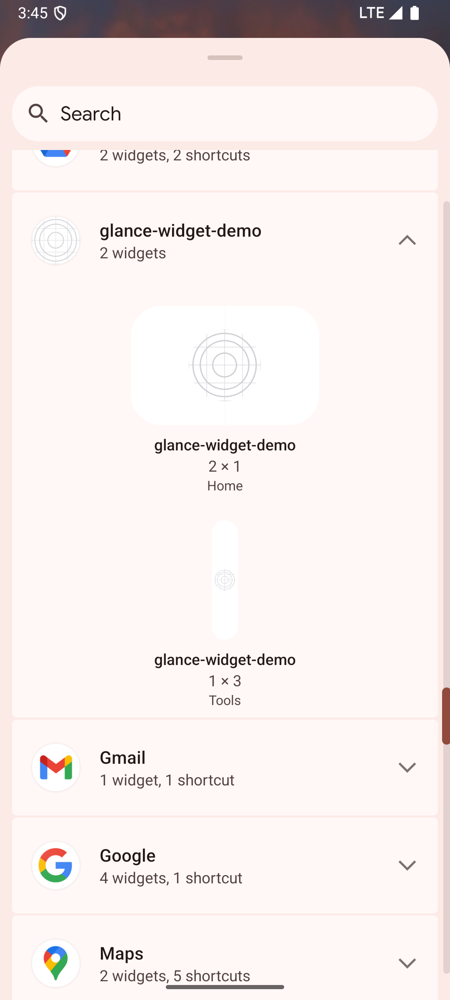
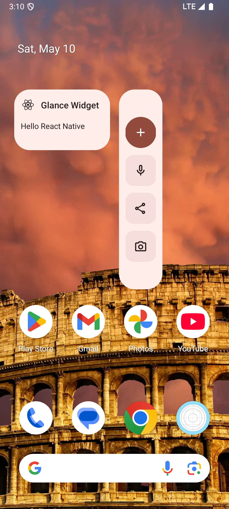
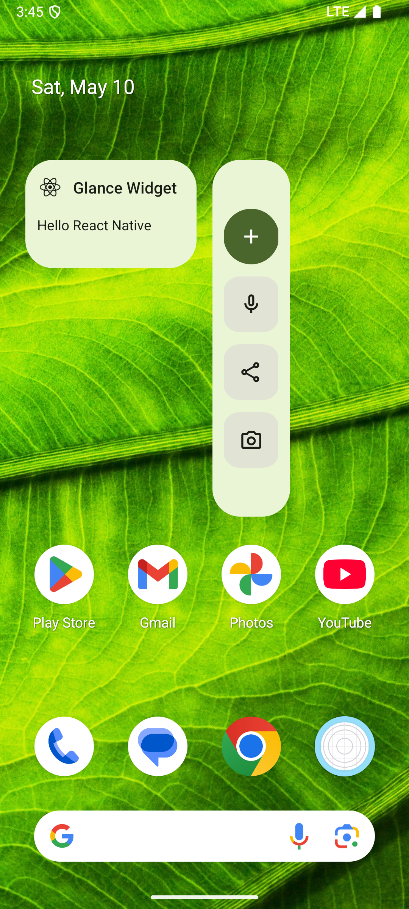

# Expo Android Glance Widget Plugin

This Expo config plugin enables Jetpack Glance Android widgets inside a React Native project using the Expo prebuild system.

## ✨ Features

* Generates `AppWidget` and `WidgetReceiver` Kotlin files.
* Adds Glance dependencies in `build.gradle`.
* Syncs widget source code from a `/widgets` folder into the native project during prebuild.
* Creates `res/xml` files for `AppWidgetProviderInfo` metadata during prebuild.
* Injects `<receiver>` entries into `AndroidManifest.xml`.
* Supports widget image and XML assets.

## 🚀 Getting Started

### Clone the Repository

To get started, clone the repository to your local machine:

```bash
git clone https://github.com/akshayjadhav4/expo-glance-widget.git
cd expo-glance-widget
```

### Install Dependencies and Build

Before using the plugin, install the required dependencies:

```bash
npm install
```

Then build the plugin:

```bash
npm run build
```

> After build, run `npm install` again to re-link the compiled output from `dist/`. This step ensures the plugin code is registered correctly for use with Expo.

### Configure the Plugin

Link the plugin in your `app.json` or `app.config.js`:

```js
plugins: [
  [
    "./app.plugin.js",
    {
      "widgets": [
        {
          "widgetName": "HomeWidget",
          "widgetProviderInfo": {
            "description": "Home",
            "minWidth": "128dp",
            "minHeight": "50dp",
            "minResizeWidth": "128dp",
            "minResizeHeight": "50dp",
            "resizeMode": "horizontal|vertical",
            "widgetCategory": "home_screen"
          }
        }
      ]
    }
  ]
]
```

### Generate Android Project

Run the following command to generate the `android/` directory and apply the plugin:

```bash
npx expo prebuild -p android --clean
```

### Widget File Structure

Write your Jetpack Glance widget code outside the Android folder:

```
/widgets
  ├── MyAppWidget.kt
  ├── MyAppWidgetReceiver.kt
  └── assets
       ├── plus_icon.png
       └── background.xml
```

This structure gets synced to the Android project automatically during prebuild.

### ⚠️ Important

After **every change** in `/widgets`, rerun:

```bash
npx expo prebuild -p android
```

## 🔄 How It Works

* On `expo prebuild`, the plugin:

  * Add dependencies for glance plugin in `android/app/build.gradle`
  * Creates `res/xml/*.xml` provider files
  * Inserts receivers into the manifest dynamically
  * Syncs Kotlin files from `/widgets/` into the Android `Main` source set
  * Copies supported image assets into `res/drawable`
  * Adds strings to `strings.xml` if using `@string/...` references

## ⚡ Supported Assets

* `.png`, `.jpg`, `.jpeg`, `.webp`, `.xml`
* Ignores unsupported files (e.g. `.svg`)
* Skips files with invalid Android resource names (e.g. `react-logo.png` ❌)

## Dynamic Theming

Widgets can be styled using `GlanceTheme.colors` to support light/dark themes and Material You surfaces like `primary`, `surfaceVariant`, and `onSurface`.


## Demo

<div style="display: flex; justify-content: space-around; align-items: center; gap: 20px;">

<div style="text-align: center;">
   
   <p>Widget Picker</p>
</div>

<div style="text-align: center;">
   
   <p>Theme One</p>
</div>

<div style="text-align: center;">
   
   <p>Theme Two</p>
</div>

</div>

